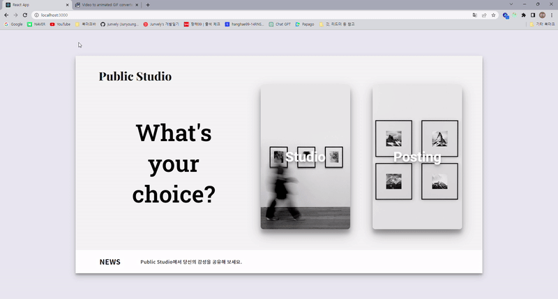

## 📷 Public Studio

### 1. 프로젝트 Description

- Public Studio, 감성이 공유되는 공간

#### 로그인 페이지

## 

#### 메인 페이지

### 2. 프로젝트 기간

2023.04.30 ~ 2023.05.04

<br />

## 🕹️ Stack

### 패키지 설치

1. 상태 관리 : redux-toolkit, react-query
2. Routing : react-router-dom
3. 데이터 통신 : axios
4. Server : JSON-server
5. CSS : styled-components

```
yarn add styled-components
yarn add react-query
yarn add redux react-redux
yarn add react-router-dom
yarn add @reduxjs/toolkit
yarn add axios
yarn add json-server
yarn json-server --watch db.json --port 4000
```

<br />

## 💡 요구사항

### 기능

(1) 공통 - UI 구현하기 - API 명세서 작성하기

(2) CRUD 구현 - 본문 리스트 조회 하기 - 본문 조회 하기 - 본문 추가 하기 - 본문 삭제 하기 - 본문 수정 하기

(3) 배포 - json-server 서버 배포 (heroku 사용) - 리액트 프로젝트 배포 (S3, vercel 등 자유)

<br />

## ✨ Page 및 컴포넌트 설계

### Page 설계

- IntroPage
- MainPage
- PostsPage
- PostingPage
- DetailPage

### common 컴포넌트 설계

- AirBox
- Button
- Footer

### 컴포넌트 설계

- Header
- Input
- Post
- NewPostsList
- ModifyPost

<br />

## ✨ 기능 구현 목표

#### IntroPage

#### MainPage

- 페이지 라우팅 : 포스팅 리스트, 포스팅 추가 페이지로 이동

#### PostsPage

- 본문 리스트 조회 하기

- 본문 삭제 하기

#### PostingPage

- 본문 추가 하기

#### DetailPage

- 본문 조회 하기

- 본문 수정 하기

<br />

## 🖇️ Redux 전역 상태 관리 -> react query 리팩토링

1. posts => posts, post

<br />

## ✅ Commit Convention

```
Feat : 새로운 기능을 추가할 경우
Fix : 버그를 고친 경우
Design : CSS 등 사용자 UI 디자인 변경
Refactor : 프로덕션 코드 리팩토링
Docs : 문서를 수정한 경우
Rename : 파일 혹은 폴더명을 수정하거나 옮기는 작업만인 경우
Remove : 파일을 삭제하는 작업만 수행한 경우
```
